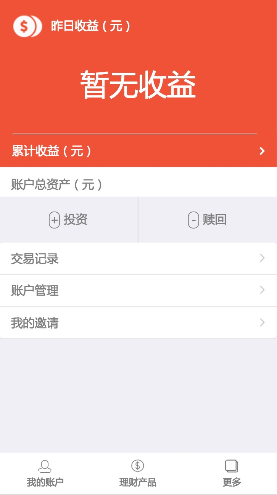

# jQuery Mobile+blaze+meteor开发基于微信的H5应用
# 描述
>基于微信的理财产品。
## 主要技术栈：
- jQuery Mobile
- blaze
- jQuery
- nodejs
- meteor

# 如何运行
## 下载项目
    git clone https://github.com/hszheng/runningTurkey.git
## 安装node环境
    curl https://install.meteor.com/ | sh
## 初始化项目
    meteor npm install
## 启动
    meteor --port 3006
> 手机浏览器或PC浏览器模拟器查看效果

